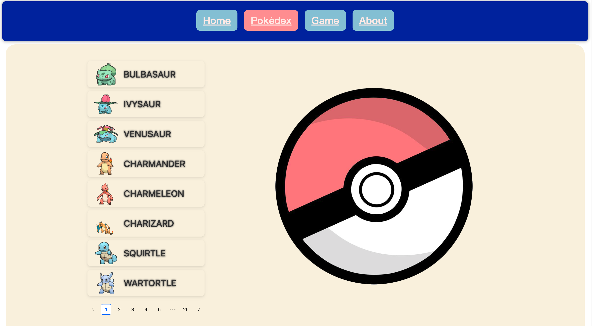

### VUE study with pokemon feature



##### Done

1. Display of Pokémon encyclopedia, the number to be displayed can be defined in `POKEMON_AMOUNT` in the `/src/model/PokemonAPI.ts`

2. Pokémon can be captured randomly, which requires a pokemon coin
3. Pokemon coin recharge is realized

### Compiles and minifies for production

```
npm run build
```

### Run the project

```
npm run dev
```

### PS: Database use json-server

```
npx json-server db/db.json
```

or

```
npm run db
```

Runs the test-server.
Open http://localhost:9009/users to view data in Browser.

To install test-server, run: `npm install -g json-server`
