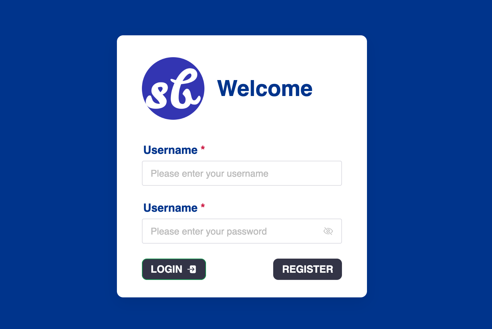
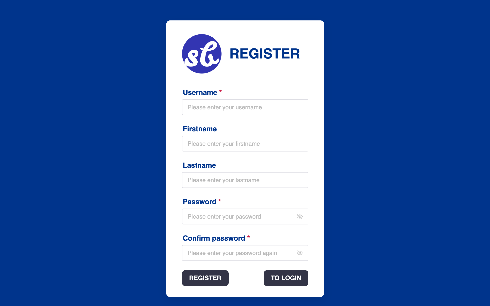
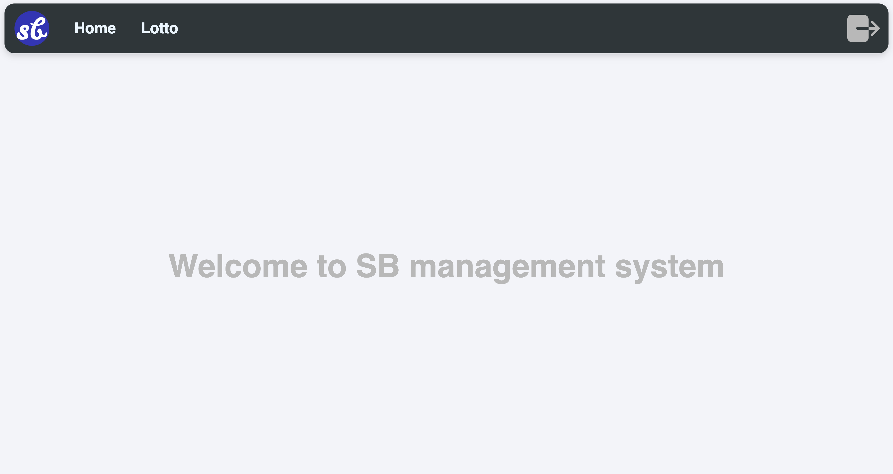
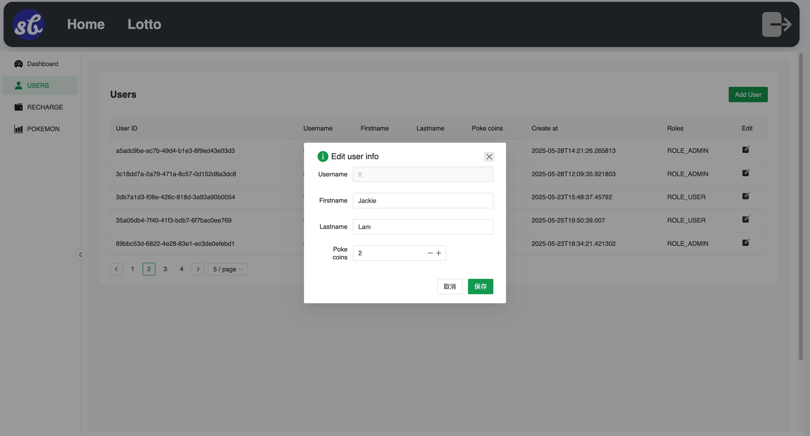
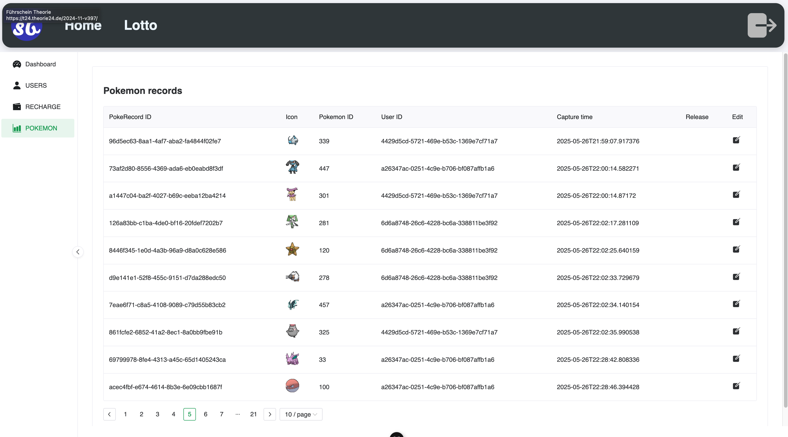

# sb-management

## Quickly start

#### Backend with springboot

The project can currently use docker to set up the backend.
You only need to give the following command in the terminal to deploy the backend with springboot.

```bash
npm run setup-backend
```

#### New Start the backend

After the initial deployment, you can simply enter the following command in the terminal to quickly start the container next time.

```bash
npm run backend
```

Prerequisite: Make sure you have installed docker

#### Start the frontend

To start the frontend UI for manager, run:

```bash
npm run dev
```

## Almost done && UI

#### Login page



#### Register page



#### Home page



#### User management component can be modify



#### Pokemon record management component can be modify



## sb_backend 👇

```
https://github.com/lzruiv4/sb-backend
```
